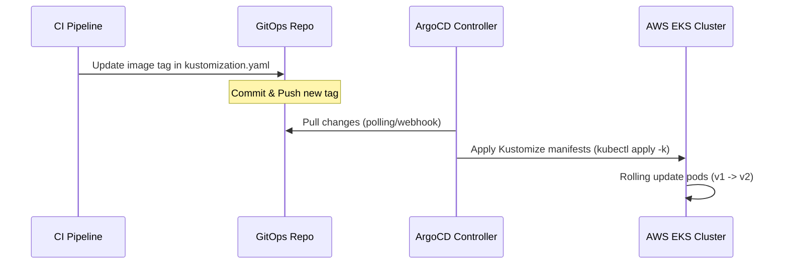

# MathSync GitOps Manifests

This repository contains the Kubernetes manifests and GitOps configurations for deploying the **MathSync** application backend. It is designed to work with **Kustomize** and **ArgoCD** for automated, continuous delivery.

---

## Architecture Flow

When a new container image is built by CI:
1. The CI pipeline updates the image tag in [kustomization.yaml](file:///c:/Users/awse/Desktop/DEVOPS/GITOPS/kustomization.yaml).
2. ArgoCD detects the commit in this GitOps repository.
3. ArgoCD applies the changes automatically to the AWS EKS Cluster, performing a rolling update of the API server.



---

## Directory Structure & Manifests

This repository is structured as a flat directory containing Kustomize resources:

* **[namespace.yaml](file:///c:/Users/awse/Desktop/DEVOPS/GITOPS/namespace.yaml)**: Creates the target namespace `mathsync`.
* **[deployment.yaml](file:///c:/Users/awse/Desktop/DEVOPS/GITOPS/deployment.yaml)**: Defines the deployment configurations for `mathsync-api`:
  * **Replicas**: 2 instances with `RollingUpdate` strategy (no downtime: `maxUnavailable: 0`, `maxSurge: 1`).
  * **Resource Allocations**: Requests 250m CPU / 256Mi RAM; limits 500m CPU / 512Mi RAM.
  * **Probes**: Configures readiness probe (10s delay, 5s check) and liveness probe (20s delay, 10s check) hitting `/health` on port `5500`.
  * **Config Injection**: Imports environment variables from the `mathsync-secret` secret map.
* **[service.yaml](file:///c:/Users/awse/Desktop/DEVOPS/GITOPS/service.yaml)**: Declares a `LoadBalancer` service named `mathsync-service` routing public traffic on port `80` to container port `5500`.
* **[servicemonitor.yaml](file:///c:/Users/awse/Desktop/DEVOPS/GITOPS/servicemonitor.yaml)**: Integrates the API with Prometheus Operator (`kube-prometheus-stack`). It tells Prometheus to scrape metrics from the `/metrics` endpoint on port `5500` every 15 seconds.
* **[kustomization.yaml](file:///c:/Users/awse/Desktop/DEVOPS/GITOPS/kustomization.yaml)**: Orchestrates resource execution order and handles declarative image tag overrides.
* **[secret.yaml](file:///c:/Users/awse/Desktop/DEVOPS/GITOPS/secret.yaml)**: Contains runtime config variables (e.g. MongoDB connection string, Port, Cloudinary credentials, Arcjet key).

> [!WARNING]
> **Secrets in Git**: Storing raw base64 or plaintext secrets (`secret.yaml`) in a Git repository is a security risk. In production environments, consider adopting a secrets manager solution like **AWS Secrets Manager** with **External Secrets Operator (ESO)**, **Sealed Secrets**, or **HashiCorp Vault**.

---

## Configuration Variables Reference

The application container reads configurations from the `mathsync-secret` secret. Here are the key environment variables defined in `secret.yaml`:

| Variable Name | Description | Example / Default |
|---|---|---|
| `PORT` | Container binding port | `5500` |
| `NODE_ENV` | Mode of deployment | `production` |
| `DB_URI` | MongoDB Connection String | `mongodb+srv://...` |
| `JWT_SECRET` | Secret key for signing Auth JWTs | `secret` |
| `ARCJET_KEY` | Key for security rate limiting and protection | `ajkey_...` |
| `CLOUDINARY_*` | Cloudinary credentials for media upload assets | `del8molgi` |

---

## Manual Deployment

If you want to apply the configuration manually without ArgoCD, ensure your `kubectl` context points to the correct cluster, then follow these steps:

### 1. Apply Secrets
Ensure the secrets are configured on the cluster first:
```bash
kubectl apply -f secret.yaml
```

### 2. Apply Kustomize Resources
Deploy the namespace, deployment, service, and service monitor configurations using Kustomize:
```bash
kubectl apply -k .
```

### 3. Verify Deployment
Monitor the status of the rollout and services:
```bash
# Check Pods
kubectl get pods -n mathsync

# Check Service & LoadBalancer External IP
kubectl get svc -n mathsync

# View logs of the running container
kubectl logs -f deployment/mathsync-api -n mathsync
```

---

## ArgoCD GitOps Integration

To set up automatic deployments with ArgoCD, create the following Application manifest in your ArgoCD control plane:

```yaml
apiVersion: argoproj.io/v1alpha1
kind: Application
metadata:
  name: mathsync-backend
  namespace: argocd
spec:
  project: default
  source:
    repoURL: 'https://github.com/<your-org>/mathsync-gitops.git' # Replace with this GitOps repository URL
    targetRevision: HEAD
    path: .
  destination:
    server: 'https://kubernetes.default.svc'
    namespace: mathsync
  syncPolicy:
    automated:
      prune: true
      selfHeal: true
```

### CI/CD Image Updates
In your application code repository CI workflow (e.g. GitHub Actions), automatically bump the image tag in Kustomize after a successful Docker build:

```bash
# Within the GitOps checkout folder in CI
cd path/to/gitops
kustomize edit set image 480582412269.dkr.ecr.ap-southeast-1.amazonaws.com/mathsync-backend=480582412269.dkr.ecr.ap-southeast-1.amazonaws.com/mathsync-backend:${GITHUB_SHA::7}
git config --global user.name "gitops-bot"
git config --global user.email "gitops-bot@mathsync.com"
git commit -am "chore(release): bump mathsync-backend to ${GITHUB_SHA::7}"
git push origin main
```
